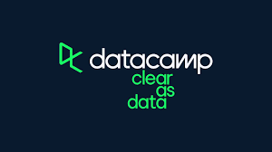

# Introduction to the Tidyverse

This is a repository for the DataCamp course Introduction to the Tidyverse. The
full course is available from [DataCamp](https://www.datacamp.com/courses/introduction-to-the-tidyverse).

## Instructor

David Robinson - Principal Data Scientist at Heap

This is an introduction to the programming language R, focused on a powerful set of tools known as the Tidyverse. You'll learn the intertwined processes of data manipulation and visualization using the tools dplyr and ggplot2. You'll learn to manipulate data by filtering, sorting, and summarizing a real dataset of historical country data in order to answer exploratory questions. You'll then learn to turn this processed data into informative line plots, bar plots, histograms, and more with the ggplot2 package. You’ll get a taste of the value of exploratory data analysis and the power of Tidyverse tools. This is a suitable introduction for those who have no previous experience in R and are interested in performing data analysis.
